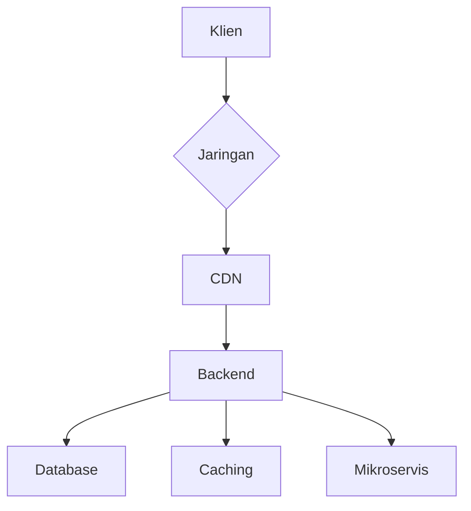

# Panduan Kinerja GKJ Website

## Ikhtisar Filosofi Kinerja

### Prinsip Dasar
- **Kecepatan**: Memaksimalkan waktu muat
- **Efisiensi**: Optimasi sumber daya
- **Skalabilitas**: Kinerja konsisten pada berbagai beban
- **Responsivitas**: Pengalaman pengguna yang mulus

## Arsitektur Kinerja



### Strategi Optimasi

#### Frontend
- Code splitting
- Lazy loading
- Minimasi bundle
- Kompresi aset

#### Backend
- Caching pintar
- Kueri database teroptimasi
- Arsitektur mikroservis
- Manajemen koneksi

## Metrik Kinerja Utama

### Web Vitals
1. **Largest Contentful Paint (LCP)**
   - Target: < 2.5 detik
   - Mengukur waktu muat konten utama

2. **First Input Delay (FID)**
   - Target: < 100ms
   - Mengukur responsivitas interaksi pertama

3. **Cumulative Layout Shift (CLS)**
   - Target: < 0.1
   - Mengukur stabilitas visual

### Metrik Tambahan
- Waktu respon API
- Utilisasi CPU/Memory
- Throughput
- Latensi jaringan

## Profiling & Monitoring

### Frontend Profiling
```typescript
// Contoh profiling React
function profilingWrapper(Component) {
  return function WrappedComponent(props) {
    const startTime = performance.now()
    
    useEffect(() => {
      const renderTime = performance.now() - startTime
      logPerformanceMetric({
        component: Component.name,
        renderTime
      })
    }, [])
    
    return <Component {...props} />
  }
}
```

### Backend Profiling
```go
func measurePerformance(fn func()) time.Duration {
    start := time.Now()
    fn()
    return time.Since(start)
}

func databaseQuery() {
    duration := measurePerformance(func() {
        // Eksekusi kueri database
        users := database.FindAll()
    })
    
    if duration > 100 * time.Millisecond {
        log.Warn("Slow query detected")
    }
}
```

## Optimasi Jaringan

### Strategi CDN
- Aset statis di edge
- Kompresi Brotli/gzip
- Caching pintar
- HTTP/3 support

### Konfigurasi Nginx
```nginx
server {
    # Kompresi
    gzip on;
    gzip_types text/plain text/css application/json;
    
    # Caching
    location ~* \.(js|css|png|jpg|jpeg|gif|ico)$ {
        expires 1y;
        add_header Cache-Control "public, no-transform";
    }
}
```

## Manajemen Sumber Daya

### Frontend Resource Management
```typescript
// Code splitting dengan React.lazy
const DashboardPage = React.lazy(() => 
  import('./pages/DashboardPage')
)

function App() {
  return (
    <Suspense fallback={<LoadingIndicator />}>
      <DashboardPage />
    </Suspense>
  )
}
```

### Backend Resource Pools
```go
type ResourcePool struct {
    maxConnections int
    activeConnections int
    queue chan interface{}
}

func (p *ResourcePool) Acquire() interface{} {
    if p.activeConnections < p.maxConnections {
        p.activeConnections++
        return createResource()
    }
    return <-p.queue
}
```

## Pengujian Beban

### Skenario Pengujian
- Pengguna konkuren
- Pola lalu lintas realistis
- Simulasi beban puncak

### Alat
- k6
- Apache JMeter
- Locust

```javascript
// Contoh skenario k6
import http from 'k6/http';
import { check, sleep } from 'k6';

export let options = {
  vus: 100,
  duration: '5m',
};

export default function() {
  let res = http.get('https://gkj-website.com');
  check(res, { 'status was 200': (r) => r.status == 200 });
  sleep(1);
}
```

## Konfigurasi CI/CD untuk Kinerja

```yaml
performance-test:
  stage: test
  script:
    - npm run build
    - npm run test:performance
    - k6 run load-test.js
  artifacts:
    reports:
      performance: performance-report.json
```

## Rencana Pengembangan Kinerja

### Fase 1: Fondasi
- Baseline performance
- Optimasi dasar
- Monitoring awal

### Fase 2: Penguatan
- Analisis mendalam
- Optimasi lanjutan
- Skalabilitas

### Fase 3: Inovasi
- Machine learning untuk prediksi
- Adaptive performance
- Otomatisasi optimasi

## Alat & Referensi

- Chrome DevTools
- Lighthouse
- WebPageTest
- New Relic
- Datadog

## Pertimbangan Masa Depan
- Web Assembly
- HTTP/3
- Edge computing
- AI-driven optimization

**Terakhir Diperbarui**: 27 Januari 2025
