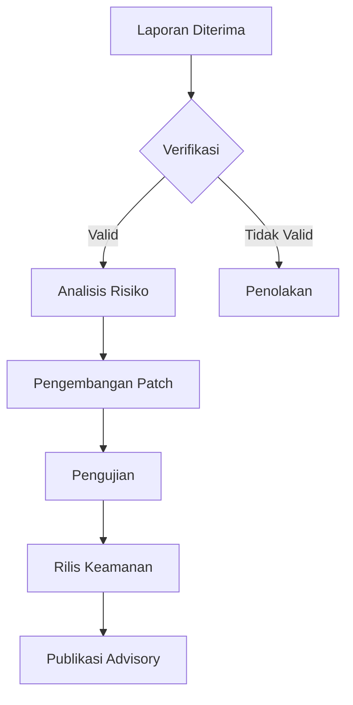

# Kebijakan Keamanan GKJ Website

## Ikhtisar Filosofi Keamanan

### Prinsip Dasar
- **Perlindungan Data**: Melindungi informasi sensitif jemaat
- **Privasi**: Menjamin kerahasiaan data pribadi
- **Ketahanan**: Mencegah dan mengurangi risiko keamanan
- **Transparansi**: Komunikasi terbuka tentang praktik keamanan

## Versi yang Didukung

| Versi | Status Dukungan | Periode Dukungan |
|-------|-----------------|------------------|
| 1.x.x | ✅ Aktif        | 2 tahun          |
| 0.9.x | ✅ Maintenance  | 1 tahun          |
| < 0.9 | ❌ Tidak Aktif  | Tidak didukung   |

## Tingkat Risiko Keamanan

| Tingkat | Deskripsi | Respons | Waktu Tanggap |
|---------|-----------|---------|---------------|
| Kritis  | Potensi pelanggaran data masif | Segera diperbaiki | < 24 jam |
| Tinggi  | Kerentanan signifikan | Diperbaiki cepat | < 72 jam |
| Sedang  | Potensi risiko terbatas | Direncanakan | < 1 minggu |
| Rendah  | Celah minor | Dipantau | < 30 hari |

## Pelaporan Kerentanan

### Saluran Pelaporan

1. **Email Resmi**: 
   ```
   security@gkj-website.com
   ```

2. **Enkripsi PGP**:
   - Gunakan kunci publik PGP untuk komunikasi sensitif
   - Kunci tersedia di [security-pgp-key.asc]

3. **Platform Resmi**:
   - HackerOne
   - Bugcrowd

### Informasi yang Dibutuhkan

Sertakan detail berikut dalam laporan:

- Tipe kerentanan
- Jalur berkas sumber
- Lokasi kode yang terpengaruh
- Konfigurasi khusus
- Langkah reproduksi mendetail
- Bukti konsep (opsional)
- Potensi dampak

### Proses Pelaporan



## Praktik Keamanan

### 1. Otentikasi & Otorisasi

#### Strategi
- JWT dengan masa berlaku pendek
- Rotasi token otomatis
- Multi-factor authentication
- Pembatasan percobaan login

#### Contoh Implementasi
```typescript
interface AuthConfig {
  maxLoginAttempts: number
  tokenExpiration: string
  mfaRequired: boolean
}

const secureAuthConfig: AuthConfig = {
  maxLoginAttempts: 5,
  tokenExpiration: '30m',
  mfaRequired: true
}
```

### 2. Perlindungan Data

#### Enkripsi
- Data sensitif dienkripsi di rest dan transit
- Gunakan AES-256 untuk penyimpanan
- HTTPS/TLS untuk komunikasi

#### Contoh Enkripsi
```typescript
function encryptSensitiveData(data: string): string {
  const salt = crypto.randomBytes(16)
  const key = crypto.scryptSync(process.env.ENCRYPTION_SECRET, salt, 32)
  const iv = crypto.randomBytes(16)
  
  const cipher = crypto.createCipheriv('aes-256-cbc', key, iv)
  let encrypted = cipher.update(data, 'utf8', 'hex')
  encrypted += cipher.final('hex')
  
  return `${salt.toString('hex')}:${iv.toString('hex')}:${encrypted}`
}
```

### 3. Validasi Input

#### Strategi
- Sanitasi input
- Pembatasan panjang
- Penolakan karakter berbahaya
- Validasi tipe data

#### Contoh Validasi
```typescript
function validateUserInput(input: string): boolean {
  const sanitizedInput = DOMPurify.sanitize(input)
  const maxLength = 100
  const allowedChars = /^[a-zA-Z0-9\s]+$/

  return (
    sanitizedInput.length <= maxLength && 
    allowedChars.test(sanitizedInput)
  )
}
```

### 4. Pencegahan Serangan Umum

| Jenis Serangan | Mitigasi |
|----------------|----------|
| SQL Injection | Prepared statements |
| XSS | Sanitasi input, CSP |
| CSRF | Token unik, SameSite cookies |
| Rate Limiting | Batasi permintaan API |

### 5. Manajemen Rahasia

- Gunakan environment variables
- Jangan commit rahasia
- Gunakan secret management tools
- Rotasi kredensial secara berkala

### 6. Logging & Monitoring

#### Praktik
- Log aktivitas keamanan
- Deteksi anomali
- Analisis real-time
- Notifikasi insiden

## Proses Tanggap Insiden

1. Deteksi
2. Isolasi
3. Investigasi
4. Mitigasi
5. Pemulihan
6. Pelaporan

## Rencana Pengembangan Keamanan

### Fase 1: Fondasi
- Implementasi dasar keamanan
- Audit kerentanan awal

### Fase 2: Penguatan
- Pengujian penetrasi
- Perbaikan berkelanjutan
- Sertifikasi keamanan

### Fase 3: Transformasi
- Kecerdasan buatan untuk deteksi ancaman
- Otomatisasi respons keamanan

## Sumber Daya Eksternal

- OWASP Top 10
- NIST Cybersecurity Framework
- ISO/IEC 27001

## Kontak Keamanan

**Tim Keamanan GKJ**
- Email: security@gkj-website.com
- PGP Fingerprint: `XXXX XXXX XXXX XXXX`
- Jam Operasional: 24/7

## Pengungkapan Tanggung Jawab

Kami berkomitmen untuk:
- Kerahasiaan pelapor
- Proses transparan
- Apresiasi kontribusi keamanan

**Terakhir Diperbarui**: 27 Januari 2025
